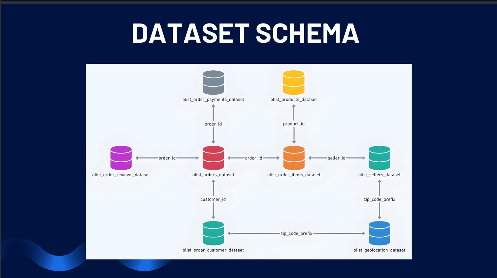
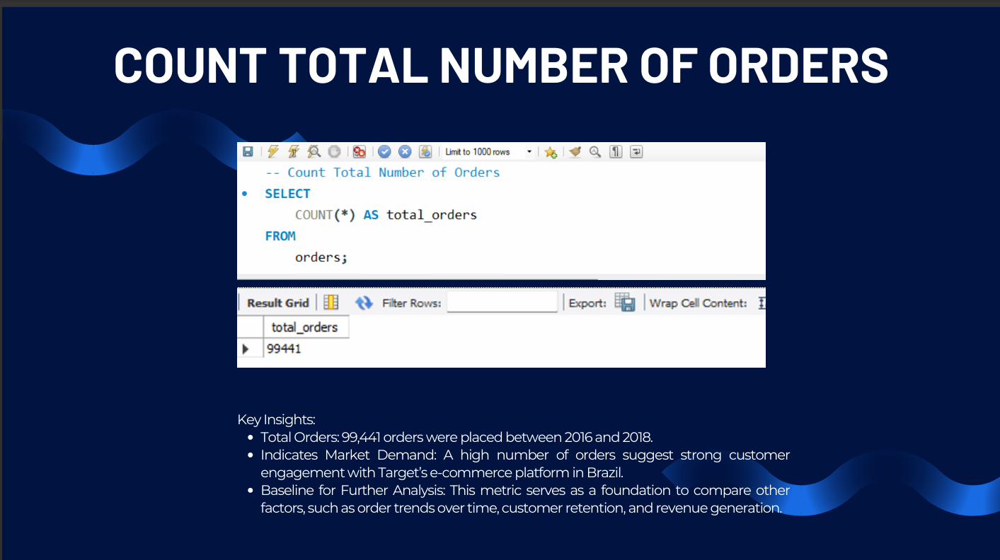
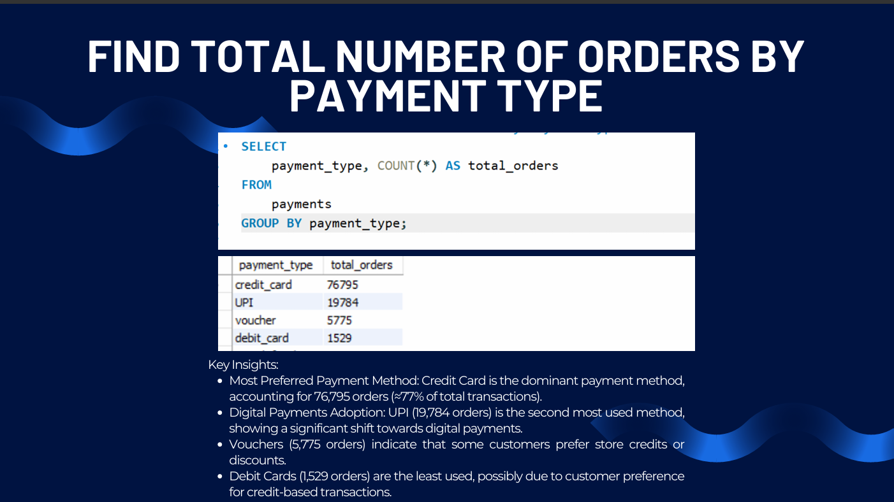
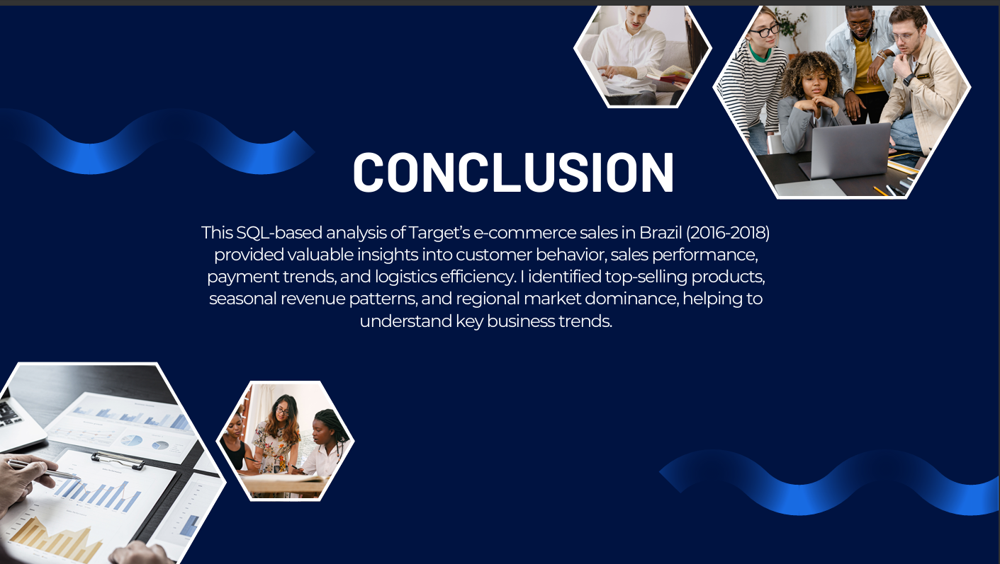

# 🛒 Target Brazil E-Commerce SQL Analysis

### SQL | Data Analytics | Relational Database Analysis

An SQL-based analysis of Target's e-commerce operations in Brazil, using transactional data from **2016 to 2018**.

The project analyzes customer activity, orders, products, payments, sellers, shipping costs, sales performance, and regional patterns using a relational database structure.

---

## 🎯 Business Problem

An e-commerce business generates large volumes of transactional data across customers, orders, products, payments, sellers, and locations.

The objective of this project was to use SQL to understand key areas of the business, including:

- Sales performance
- Customer and regional activity
- Product demand
- Payment preferences
- Seller distribution
- Shipping costs
- Sales trends
- Product category performance

---

## 📊 Dataset

The project uses Target's Brazilian e-commerce dataset covering **2016–2018**.

The dataset contains approximately **100,000 orders** and multiple related tables covering different aspects of the e-commerce operation.

### Main Tables

- Customers
- Orders
- Order Items
- Products
- Payments
- Sellers
- Geolocation
- Order Reviews

---

## 🗄️ Database Structure

The project uses a relational database consisting of multiple connected tables.

The relationships between customers, orders, products, payments, sellers, and geographic information allow the analysis to combine data from multiple business areas.

---

## 🔍 Business Questions

The analysis answers questions such as:

1. What is the total number of orders?
2. What is the total revenue generated?
3. Which product was sold the most?
4. Which payment method is used most frequently?
5. Which city has the highest number of orders?
6. What is the most popular payment method in each state?
7. Which state has the highest number of sellers?
8. What is the average shipping cost per order?
9. Which month generated the highest sales revenue?
10. What are the top-selling product categories?
11. How many unique products were sold?

---

## 💻 SQL Analysis

The project uses SQL to perform:

- Aggregations
- `COUNT()`
- `SUM()`
- `AVG()`
- `COUNT(DISTINCT)`
- `GROUP BY`
- `ORDER BY`
- `LIMIT`
- Date-based analysis
- Multi-table `JOIN` operations
- Product analysis
- Geographic analysis
- Payment analysis

The analysis combines information from multiple related tables to answer business questions rather than treating the dataset as a single flat table.

---

## 📊 Business Analysis

The SQL queries were used to analyze different aspects of the e-commerce business, including sales, payment behavior, customers, products, geography, sellers, and shipping.

### Key Areas Analyzed

**Sales**
- Order volume
- Revenue
- Monthly sales performance

**Customers & Geography**
- Orders by city
- Payment preferences by state
- Regional activity

**Products**
- Most-sold products
- Product categories
- Unique products sold

**Operations**
- Seller distribution
- Payment methods
- Average shipping cost

---

## 💡 Key Findings

### Orders

The analysis identified **99,441 orders** in the orders table for the analyzed period.

### Revenue

Total revenue calculated from the order items was approximately:

**15,397,739**

### Payment Methods

Credit Card was the most frequently used payment method, with:

**76,795 transactions**

UPI followed with:

**19,784 transactions**

Other payment methods included vouchers and debit cards.

### Geographic Activity

**São Paulo** recorded the highest number of orders, with:

**15,540 orders**

São Paulo also had the highest number of registered sellers, with:

**1,849 sellers**

### Shipping

The calculated average shipping cost per order was:

**20**

### Sales Trend

**November 2017** recorded the highest monthly sales revenue:

**1,010,271**

This result provides an opportunity for further investigation into seasonal sales patterns and promotional activity.

### Product Categories

The analysis identified the top five product categories by order volume, including categories across home & lifestyle, health & fitness, furniture & decoration, and technology-related products.

### Product Diversity

The analysis identified:

**32,951 unique products sold**

---

## 🧠 Key Insights

The analysis provides a view of the e-commerce operation across four major areas:

### Sales Performance

The analysis identifies overall order volume, revenue and monthly sales patterns.

### Customer & Regional Activity

The analysis highlights major customer markets and regional differences in activity.

### Product Demand

Product-level and category-level analysis provides visibility into demand and product diversity.

### Operations

Payment behavior, seller distribution and shipping costs provide additional insight into the operational side of the marketplace.

---

## 🛠️ Tools & Technologies

- **SQL**
- **MySQL**
- **Python** — used for importing the CSV files into SQL Server
- **Kaggle Dataset**

---

## 📄 Project Documentation

The detailed project presentation is available in:

**`E-commerce SQL.pdf`**

It contains:

- Dataset introduction
- Database schema
- Data import process
- Table exploration
- SQL queries
- Query results
- Business insights
- Conclusion
- Future scope

---

## 🚀 Future Scope

Potential extensions of the analysis include:

- Sales forecasting
- Customer segmentation
- Customer review sentiment analysis
- Delivery-time analysis
- Regional growth analysis
- Product demand forecasting
- Seller performance analysis
- Deeper product-category analysis

---

## 👨‍💻 Author

**Niraj Pawar**

Data Analyst | Business Intelligence | Data Science
